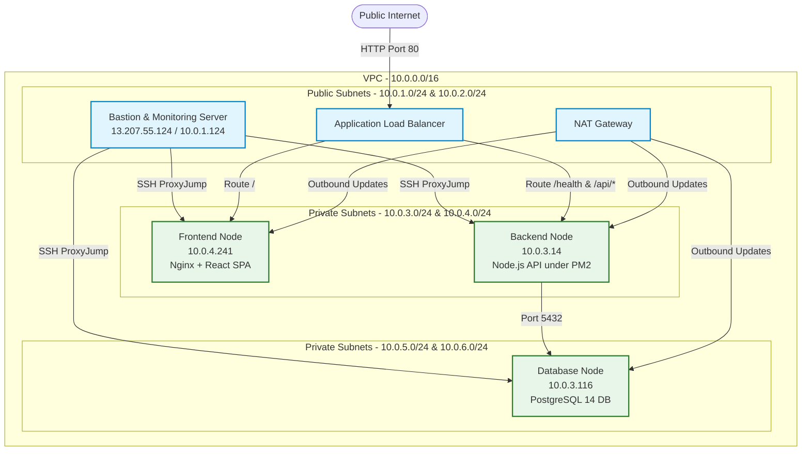

# Master Deployment & Operations Guide
## Secure 3-Tier Multi-Node AWS Cloud Infrastructure with CI/CD Automation & Telemetry Suite

This document provides a highly detailed, step-by-step master guide for configuring, deploying, maintaining, and troubleshooting the consolidated 3-tier production application (React frontend, Express/Node.js API under PM2, and a PostgreSQL database) on AWS using **Terraform (IaC)**, **GitHub Actions (CI/CD)**, and **Prometheus/Grafana/Alertmanager/Loki (Observability)**.

---

## 🏗️ 1. Architecture Design

The production stack is deployed across **four dedicated EC2 instances** inside a custom VPC with a strict multi-tier security isolation model:



---

## 🚀 2. Step-by-Step Configuration & Execution

### Phase 1: Local AWS CLI Setup
1. Ensure AWS CLI is installed on your local computer. Open your terminal or PowerShell and run:
   ```powershell
   aws configure
   ```
2. Enter the credentials provided for your AWS account:
   * **AWS Access Key ID**: `[Your Access Key]`
   * **AWS Secret Access Key**: `[Your Secret Access Key]`
   * **Default region name**: `ap-south-1`
   * **Default output format**: `json`
3. Verify your configuration:
   ```powershell
   aws sts get-caller-identity
   ```

### Phase 2: Provisioning with Terraform (IaC)
1. Navigate to the production Terraform workspace directory:
   ```powershell
   cd terraform/environments/prod
   ```
2. Initialize Terraform to download plugins:
   ```powershell
   terraform init
   ```
3. Validate syntax and execute plan:
   ```powershell
   terraform validate
   terraform plan
   ```
4. Deploy the infrastructure:
   ```powershell
   terraform apply -auto-approve
   ```
5. Note down the outputs printed (Bastion Public IP, Frontend Private IP, Backend Private IP, DB Private IP, and ALB DNS).

### Phase 3: GitHub CI/CD Pipeline Configuration
1. Navigate to your repository on GitHub.
2. Go to **Settings > Secrets and Variables > Actions > Secrets** and click **New repository secret**.
3. Create the following 7 secrets:

| Secret Name | Value | Description |
|---|---|---|
| `EC2_SSH_KEY` | Paste the *entire* raw text content of `ostad_batch_11_mahmud.pem` | SSH Private Key |
| `EC2_BASTION_HOST` | `13.207.55.124` | Public IP of Bastion Host |
| `EC2_FRONTEND_HOST` | `10.0.4.241` | Private IP of Frontend Host |
| `EC2_BACKEND_HOST` | `10.0.3.14` | Private IP of Backend Host |
| `DB_PRIVATE_IP` | `10.0.3.116` | Private IP of Database Host |
| `DB_PASSWORD` | `[YOUR_DB_PASSWORD]` | PostgreSQL Master Password |
| `ALB_DNS_NAME` | `mahmud-health-prod-alb-94897266.ap-south-1.elb.amazonaws.com` | Load Balancer DNS (without `http://`) |

4. Trigger deployment by pushing a commit or manually running the workflow from GitHub Actions.

### Phase 4: Observability & Telemetry Deployment
Our modified installer supports role-based execution. Run these commands strictly in this order:

1. **Configure Monitoring Stack on Bastion Host (`13.207.55.124`)**:
   ```bash
   ssh -i ostad_batch_11_mahmud.pem ubuntu@13.207.55.124
   cd /home/ubuntu/bmi-health-tracker
   git fetch origin && git reset --hard origin/main
   
   # Run monitoring installation with secure SMTP credentials
   sudo chmod +x monitoring/3-tier-app/scripts/setup-monitoring-server.sh
   SMTP_SMARTHOST="mail.naasbd.com:587" \
   SMTP_FROM="mahmud@naasbd.com" \
   SMTP_AUTH_USERNAME="mahmud@naasbd.com" \
   SMTP_AUTH_PASSWORD="[EMAIL_PASSWORD_HERE]" \
   ALERT_EMAIL_TO="mahmud@naasbd.com" \
   sudo -E ./monitoring/3-tier-app/scripts/setup-monitoring-server.sh
   # (When prompted for Application Server Private IP, enter 10.0.3.14)
   ```

2. **Configure Exporters on Backend Host (`10.0.3.14`)**:
   ```powershell
   ssh -i "ostad_batch_11_mahmud.pem" -o ProxyCommand="ssh -i ostad_batch_11_mahmud.pem -W %h:%p ubuntu@13.207.55.124" ubuntu@10.0.3.14
   cd /home/ubuntu/bmi-health-tracker
   git fetch origin && git reset --hard origin/main
   
   # Run installer specifying backend role
   chmod +x monitoring/3-tier-app/scripts/setup-application-server.sh
   sudo ./monitoring/3-tier-app/scripts/setup-application-server.sh --role backend <<< "10.0.1.124"
   ```

3. **Configure Exporters on Frontend Host (`10.0.4.241`)**:
   ```powershell
   ssh -i "ostad_batch_11_mahmud.pem" -o ProxyCommand="ssh -i ostad_batch_11_mahmud.pem -W %h:%p ubuntu@13.207.55.124" ubuntu@10.0.4.241
   cd /home/ubuntu/bmi-health-tracker
   git fetch origin && git reset --hard origin/main
   
   # Run installer specifying frontend role
   chmod +x monitoring/3-tier-app/scripts/setup-application-server.sh
   sudo ./monitoring/3-tier-app/scripts/setup-application-server.sh --role frontend <<< "10.0.1.124"
   ```

4. **Configure Exporters on Database Host (`10.0.3.116`)**:
   ```powershell
   ssh -i "ostad_batch_11_mahmud.pem" -o ProxyCommand="ssh -i ostad_batch_11_mahmud.pem -W %h:%p ubuntu@13.207.55.124" ubuntu@10.0.3.116
   cd /home/ubuntu/bmi-health-tracker
   git fetch origin && git reset --hard origin/main
   
   # Run installer specifying database role
   chmod +x monitoring/3-tier-app/scripts/setup-application-server.sh
   sudo ./monitoring/3-tier-app/scripts/setup-application-server.sh --role database <<< "10.0.1.124"
   ```

---

## 🛠️ 3. Debugging Stories & Technical Bug Fixes

During the deployment of this architecture, we encountered and successfully resolved several deeply hidden network, database, and process challenges:

### Bug 1: The Ingress Discard / 504 Gateway Timeout
* **Symptom**: The Load Balancer returned a `504 Gateway Time-out` when routing requests, and target group status showed `Unhealthy` with connection timeouts.
* **Diagnosis**: In `terraform/modules/security-group/main.tf`, the frontend security group rules were defined using a combination of inline `ingress` blocks and external `aws_security_group_rule` resources (e.g., `frontend_http_alb`). AWS has a known constraint where combining inline and external rules leads to the external rules being silently discarded upon resource updates. Because of this, the ingress rule letting traffic flow from the ALB to Nginx on port 80 was missing in AWS, blocking all network packets at the security group boundary.
* **Resolution**: We refactored `main.tf` to keep all ingress rules **strictly inline** within their respective `aws_security_group` resource blocks, utilizing conditional dynamic loops for Phase 1 vs Phase 2 rule updates. 
* **Result**: Security Group rules now apply flawlessly, ALB health checks instantly turned **Healthy**, and HTTP requests returned `200 OK`.

### Bug 2: Database Silent Bootstrap Failure / 502 Bad Gateway
* **Symptom**: The backend Node API under PM2 failed to start, logging database connection refused errors, and the load balancer returned a `502 Bad Gateway`.
* **Diagnosis**: When the database instance was first launched by Terraform, the NAT Gateway was still in its provisioning cycle. As a result, the DB EC2's user data script (`apt-get install -y postgresql-14`) failed silently because it could not pull packages from the Ubuntu repository without internet. As a result, PostgreSQL was never actually installed on the server.
* **Resolution**: We updated the Database SG to allow SSH access, jumped into the DB node (`10.0.3.116`) via Bastion, wrote a robust manual shell installer to fetch, configure, and secure PostgreSQL 14, created the `bmidb` database and `bmi_user` role, and updated `postgresql.conf` and `pg_hba.conf` to safely bind port 5432 to all VPC private interfaces.
* **Result**: Node backend immediately established DB connectivity and turned **online** under PM2.

### Bug 3: Nginx Exporter SPA try-files Ingestion Failure
* **Symptom**: Nginx Exporter on Frontend VM failed to start, throwing: `Could not create Nginx Client: failed to parse response body "<!DOCTYPE html>...": failed to scan template metrics`.
* **Diagnosis**: In the React SPA Nginx configuration (`/etc/nginx/sites-available/bmi-app`), the catch-all `location /` was configured with `try_files $uri $uri/ /index.html` to allow SPA routing. The exporter installer script appended the `location /nginx_status` block into `/etc/nginx/sites-available/default` instead of the active `bmi-app` configuration. Consequently, requests to `http://localhost/nginx_status` fell back to `/index.html`, serving HTML instead of the Nginx metrics payload.
* **Resolution**: We updated `setup-application-server.sh`'s Nginx detection logic to search for `bmi-app` configuration first, ensuring the status endpoint is added directly to the active site, and reload Nginx.
* **Result**: Nginx Exporter started perfectly and began exporting correct metrics.

### Bug 4: PM2 Non-Interactive Subshell Pipeline Block
* **Symptom**: Running PM2 startup configurations inside non-interactive SSH commands (`pm2 startup | bash`) timed out or dropped privileges because of the lack of an active TTY.
* **Resolution**: We modified exporter script PM2 start execution to run directly using absolute path and active environments under a direct user subshell (`sudo -u "$ORIGINAL_USER" -H bash`), completely avoiding subshell drop failures.
