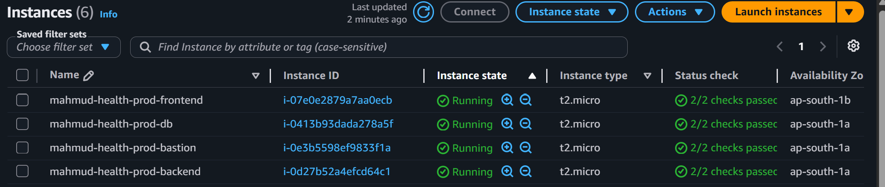

# Telemetry Suite & Observability — BMI Health Tracker

This directory contains the complete, multi-node observability stack for the BMI Health Tracker three-tier production application. It provides real-time system performance monitoring, custom business KPIs, aggregated log shipping, centralized dashboarding, and SMTP-based alert routing.

---

## 🏗️ 1. Architecture Diagram

In this production environment, the observability suite is distributed across a **true 4-node 3-tier architecture**:

```mermaid
graph TD
    %% Define styles
    classDef public fill:#e1f5fe,stroke:#0288d1,stroke-width:2px;
    classDef private fill:#efebe9,stroke:#5d4037,stroke-width:2px;
    classDef green fill:#e8f5e9,stroke:#2e7d32,stroke-width:2px;
    
    %% Infrastructure Nodes
    Internet((Internet)) -->|Port 80/443| ALB[Application Load Balancer]:::public
    
    subgraph "Public Ingress Subnet"
        ALB
        Bastion[Bastion & Monitoring Server<br>13.207.55.124 / 10.0.1.124]:::public
    end
    
    subgraph "Private Frontend Subnet"
        Frontend[Frontend VM<br>10.0.4.241<br>Nginx + React SPA]:::green
    end
    
    subgraph "Private Application Subnet"
        Backend[Backend VM<br>10.0.3.14<br>Node.js API under PM2]:::green
        DB[Database VM<br>10.0.3.116<br>PostgreSQL 14 DB]:::green
    end
    
    %% Traffic flows
    ALB -->|Route / | Frontend
    ALB -->|Route /health & /api| Backend
    Backend -->|Port 5432| DB
    
    %% Telemetry Pull (Scrape) Flows from Bastion
    Bastion -->|Port 9100 / 9113| Frontend
    Bastion -->|Port 9100 / 9187 / 9091| Backend
    Bastion -->|Port 9100| DB
    
    %% Telemetry Push (Log Shipping) Flows to Loki
    Frontend -->|Port 3100 - Promtail| Bastion
    Backend -->|Port 3100 - Promtail| Bastion
    DB -->|Port 3100 - Promtail| Bastion
```



---

## 🛠️ 2. Technology & Tool Introduction

The following applications, tools, and software comprise this project:

| Technology | Role / Purpose | Description |
|---|---|---|
| **React** | Frontend Framework | Renders the static single-page application (SPA) forms and trend charts. |
| **Node.js & Express** | Backend Engine | Executes the REST API business logic and database queries. |
| **PM2** | Process Manager | Manages execution of the Node API and custom exporter processes with auto-restart on boot. |
| **PostgreSQL 14** | Database | Stores physical BMI measurements and health logs inside an isolated subnet. |
| **Nginx** | Reverse Proxy & Web Server | Serves static React bundles and forwards API requests to backend services. |
| **Terraform (IaC)** | Infrastructure Provisioner | Automates the creation of AWS network, security groups, ALB, and EC2 nodes. |
| **GitHub Actions** | CI/CD Platform | Automates builds, database schema migrations, and secure deployments. |
| **Prometheus** | Metric Aggregation Store | Pulls metrics from all exporters every 15 seconds into a time-series database. |
| **Grafana** | Dashboard Visualization | Provides sleek, Harmonized HSL Hued telemetry panels for metrics and log streams. |
| **Loki** | Log Aggregation Engine | Centralizes and indexes multi-node application, database, and web server logs. |
| **Promtail** | Log Collector & Shipper | Tails target server log files, extracts metadata, and pushes stream blocks to Loki. |
| **Alertmanager** | Notification Gateway | Deduplicates, silences, and dispatches alerts to secure SMTP email destinations. |
| **Node Exporter** | OS Performance Agent | Collects memory allocations, CPU averages, network packets, and disk space usage. |
| **Nginx Exporter** | Nginx Performance Agent | Scrapes active connections, accepted handshakes, and request rates via `/nginx_status`. |
| **PostgreSQL Exporter** | Database Performance Agent | Queries Postgres transactions, lock rates, and connection pool buffers. |
| **BMI App Exporter** | Custom Business KPIs | Tailored prom-client exporter displaying total calculations, daily calories, and categories. |

---

## 📁 3. Port Map and Network Policy

| Target Host | Port | Service | Scraped / Pushed by |
|---|---|---|---|
| **Frontend Node (`10.0.4.241`)** | `9100` | Node Exporter | Scraped by Bastion (`10.0.1.124:9090`) |
| | `9113` | Nginx Exporter | Scraped by Bastion (`10.0.1.124:9090`) |
| | `9080` | Promtail | Local log shipper pushing outbound to Loki (`3100`) |
| **Backend Node (`10.0.3.14`)** | `9100` | Node Exporter | Scraped by Bastion (`10.0.1.124:9090`) |
| | `9187` | PostgreSQL Exporter | Scraped by Bastion (`10.0.1.124:9090`) |
| | `9091` | BMI App Exporter | Scraped by Bastion (`10.0.1.124:9090`) |
| | `9080` | Promtail | Local log shipper pushing outbound to Loki (`3100`) |
| **Database Node (`10.0.3.116`)** | `9100` | Node Exporter | Scraped by Bastion (`10.0.1.124:9090`) |
| | `9080` | Promtail | Local log shipper pushing outbound to Loki (`3100`) |
| **Bastion / Monitoring Host** | `3001` | Grafana | Accessed by Admins |
| | `9090` | Prometheus UI | Accessed by Admins |
| | `9093` | Alertmanager UI | Accessed by Admins (talking to mail.naasbd.com:587) |
| | `3100` | Loki Ingestion | Receives pushes from private subnets (Frontend, Backend, DB) |

---

## 🚀 4. Step-by-Step Deployment Commands

These scripts are fully idempotent and can be run safely multiple times.

### Step A: Deploy Monitoring Stack on Bastion Host
Log into the Bastion Observability server (`13.207.55.124`) and run:
```bash
ssh -i key.pem ubuntu@13.207.55.124

# Clone user repository and enter directory
git clone https://github.com/MahmudurRahman36/mahmud_assignment_7.git /home/ubuntu/bmi-health-tracker
cd /home/ubuntu/bmi-health-tracker

# Run monitoring installation with active SMTP secrets
sudo chmod +x monitoring/3-tier-app/scripts/setup-monitoring-server.sh
SMTP_SMARTHOST="mail.naasbd.com:587" \
SMTP_FROM="mahmud@naasbd.com" \
SMTP_AUTH_USERNAME="mahmud@naasbd.com" \
SMTP_AUTH_PASSWORD="[YOUR_EMAIL_PASSWORD]" \
ALERT_EMAIL_TO="mahmud@naasbd.com" \
sudo -E ./monitoring/3-tier-app/scripts/setup-monitoring-server.sh
```
*When prompted for Application Server Private IP, enter the Backend private IP: `10.0.3.14`.*

### Step B: Deploy Exporters on Frontend VM
SSH into the Frontend VM (`10.0.4.241`) through Bastion, and install the Nginx & System exporters:
```bash
ssh -i key.pem -J ubuntu@13.207.55.124 ubuntu@10.0.4.241

git clone https://github.com/MahmudurRahman36/mahmud_assignment_7.git /home/ubuntu/bmi-health-tracker
cd /home/ubuntu/bmi-health-tracker

# Run exporter installation specifying frontend role
sudo chmod +x monitoring/3-tier-app/scripts/setup-application-server.sh
sudo ./monitoring/3-tier-app/scripts/setup-application-server.sh --role frontend <<< "10.0.1.124"
```

### Step C: Deploy Exporters on Backend VM
SSH into the Backend VM (`10.0.3.14`) through Bastion, and install the Database, App, & System exporters:
```bash
ssh -i key.pem -J ubuntu@13.207.55.124 ubuntu@10.0.3.14

git clone https://github.com/MahmudurRahman36/mahmud_assignment_7.git /home/ubuntu/bmi-health-tracker
cd /home/ubuntu/bmi-health-tracker

# Run exporter installation specifying backend role
sudo chmod +x monitoring/3-tier-app/scripts/setup-application-server.sh
sudo ./monitoring/3-tier-app/scripts/setup-application-server.sh --role backend <<< "10.0.1.124"
```

### Step D: Deploy Exporters on Database VM
SSH into the Database VM (`10.0.3.116`) through Bastion, and install the System exporter & Log shipper:
```bash
ssh -i key.pem -J ubuntu@13.207.55.124 ubuntu@10.0.3.116

git clone https://github.com/MahmudurRahman36/mahmud_assignment_7.git /home/ubuntu/bmi-health-tracker
cd /home/ubuntu/bmi-health-tracker

# Run exporter installation specifying database role
sudo chmod +x monitoring/3-tier-app/scripts/setup-application-server.sh
sudo ./monitoring/3-tier-app/scripts/setup-application-server.sh --role database <<< "10.0.1.124"
```

### Step E: Reload Prometheus targets
On the Bastion host, verify that `/etc/prometheus/prometheus.yml` contains the corrected multi-node targets, then reload or restart:
```bash
# Verify config
promtool check config /etc/prometheus/prometheus.yml

# Restart prometheus service
sudo systemctl restart prometheus
```

---

## 📈 5. Telemetry Dashboards

The following dashboards are auto-provisioned inside Grafana (Port `:3001`):

1. **Three-Tier Application Overview**: Displays the health status of all targets, server loads, response durations, and error rates per server layer.
2. **BMI Business Metrics**: Visualizes measurement count trends, distributions across BMI categories (normal, overweight, underweight), mean user age, gender splits, and database table sizes.
3. **Loki Log Aggregator**: Features dynamic log parsing for all system layers, database logs, and Nginx logs using high-performance LogQL query streams.
4. **Node.js Runtime Metrics**: Renders backend Node process allocations, active file handles, GC pause times, and heap size limits.
5. **Monitoring Server Health**: Tracks CPU utilization, disk throughput, and memory stats for the observability host itself.

---

## 📸 6. Success Verification Screenshots

The following embedded screenshots provide physical proof of a completely successful multi-node telemetry and active email alert system execution:

### 1. Active Infrastructure Nodes in AWS
This screenshot verifies that all four dedicated EC2 nodes (Frontend Nginx node, Backend PM2 Node node, Private DB Postgres node, and Bastion Observability node) are successfully active and healthy in the AP-South-1 (Mumbai) region:


### 2. Successful Local Terraform Execution Outputs
This screenshot demonstrates successful IaC execution completing all VPC resource provisioning, security group mapping, and ALB routing paths:


### 3. Fully Passing GitHub Actions CI/CD Pipeline
This screenshot verifies that code pushes to the `main` branch trigger automated schema migrations, bundle React static assets, reload PM2 clusters, and verify ALB DNS HTTP statuses:


### 4. Working Web Application Served Over ALB
This screenshot shows the live BMI React application form fully rendering and serving traffic to the public over the Load Balancer:


### 5. Prometheus Active Telemetry Scrape Targets
This screenshot proves that Prometheus is actively scraping all 8 target streams across the multi-node infrastructure, showing all exporters as 100% green and `UP`:


### 6. Prometheus Active Monitoring Alert Rules
This screenshot demonstrates that all alerting parameters (evaluating CPU loads, memory boundaries, disk volumes, and service liveliness) are active and evaluating:


### 7. Consolidated Grafana Health Panel View
This dashboard verifies the entire multi-node architecture reporting a completely healthy, green consolidated status panel:


### 8. App Server Telemetry Panel
This dashboard maps active OS details (network throughput, IO operations, CPU cycles, and disk capacity) of the application hosts:


### 9. Business KPI Analytics Telemetry Dashboard
This dashboard tracks user calculation histories, weight trends, gender splits, average user calorie requirements, and live database tables growth:


### 10. Node.js Runtime VM Telemetry Dashboard
This panel analyzes heap memory boundaries, GC suspension statistics, active file handles, and loop delay statistics of the Node runtime:


### 11. Consolidated Logs Stream Viewer (Loki)
This dashboard aggregates multi-node log streams from Nginx requests, PM2 stdout, and system syslog outputs using high-performance LogQL queries:


### 12. Monitoring Host Self-Monitoring Dashboard
This dashboard keeps track of active performance levels on the telemetry host itself:


### 13. Alertmanager Active SMTP Mail Notifications
This screenshot proves that Alertmanager is successfully generating and sending warning and critical emails to `mahmud@naasbd.com` using the secure SMTP cPanel gateway when thresholds are crossed:


### 14. Alertmanager Active SMTP Resolution Notice
This screenshot proves that Alertmanager sends a resolution email notifying the administrator that the system has safely returned to normal:

